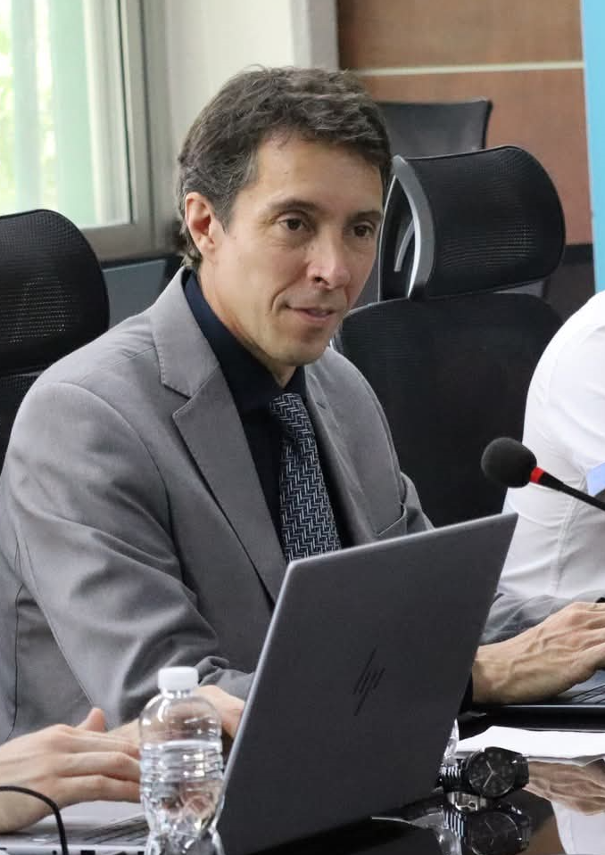

<!DOCTYPE html>
<html lang="en">
<head>
  <meta charset="UTF-8" />
  <meta name="viewport" content="width=device-width,initial-scale=1.0" />
  <title>Marcos Esteban Angelini, PhD</title>
  
</head>
<body>
  <!-- Profile picture in the top-right -->
  

  <h1>Marcos Esteban Angelini, PhD</h1>

  <section id="contact-information">
    <h2>Contact Information</h2>
    <ul>
      <li><strong>Email:</strong> <a href="mailto:Marcos.Angelini@fao.org">Marcos.Angelini@fao.org</a></li>
      <li><strong>Phone:</strong> +54 9 2323 677107</li>
      <li><strong>Location:</strong> Luján (6700), Buenos Aires, Argentina</li>
      <li><strong>LinkedIn:</strong> <a href="https://www.linkedin.com/in/angelinimarcos/">@angelinimarcos</a></li>
      <li><strong>Personal Website:</strong> <a href="https://github.com/angelini75/angelini75/edit/main/README.md">Personal website</a></li>
      <li><strong>GitHub/Portfolio:</strong> <a href="https://github.com/angelini75">GitHub Repositories</a></li>
    </ul>
  </section>

  <section id="professional-narrative">
    <h2>Professional Narrative</h2>
    
With over 20 years of international experience, my career has been dedicated to advancing sustainable land management through innovative soil science, digital soil mapping, and remote sensing technologies. I earned my PhD from Wageningen University and ISRIC–World Soil Information in 2018, specializing in Structural Equation Modelling (SEM) for digital soil mapping. My research was recognized internationally when awarded the prestigious “Best Paper in Pedometrics” by the International Union of Soil Sciences.

    
Throughout my career, I have thrived in diverse international environments, leading multidisciplinary teams and fostering strategic partnerships. At the FAO, I have coordinated and contributed significantly to global initiatives such as the Soil Atlas of Asia, GSNmap, GBSmap, and the SoilFER project. My leadership in these projects has enabled the creation and improvement of national soil information systems across Asia, Central America, and the Caribbean. I have personally facilitated numerous workshops and trainings, notably in Bhutan, Vietnam, Guatemala, Honduras, and Trinidad & Tobago, directly impacting local capabilities in digital soil mapping, soil data management, and sustainable agricultural practices.

    
Recently, I have been leading the development of a novel AI-powered decision support system that integrates soil spatial data with artificial intelligence to deliver actionable insights to farmers, advisors, and policymakers. This initiative, currently under the prototype stage, leverages cloud-based geospatial platforms, national soil maps, and Large Language Models (LLMs) with Retrieval-Augmented Generation (RAG) capabilities to provide natural-language responses to soil management questions. By transforming complex environmental data into clear, location-specific advice, this project enhances accessibility, decision-making, and capacity in sustainable land management. The platform is being piloted with 13 countries in Asia and 8 in the Caribbean and is poised for broader application.

    
My global engagements have consistently emphasized collaboration with stakeholders from government ministries, international NGOs, and research institutions. Notably, my contributions include:

    <ul>
      <li>Leading comprehensive workshops in Bhutan, enhancing regional capabilities in soil data harmonization, database management, and web mapping.</li>
      <li>Coordinating the SoilFER project’s inception and implementation workshops in Guatemala and Honduras.</li>
      <li>Facilitating hands-on digital soil mapping workshops in Trinidad & Tobago and Vietnam.</li>
    </ul>
    
One of the most memorable and impactful professional experiences was organizing the Soil Information Systems workshop in Bhutan. I coordinated every detail—from agenda design and trainer coordination to visa & travel logistics for delegates from all 13 AFACI countries—and represented the Global Soil Partnership in high-level meetings (including FAO’s DG Representative and EU donor delegates). The gratitude expressed by participants highlighted my solution-oriented mindset and pragmatic approach under pressure.

    
Driven by a passion for sustainable agriculture and environmental stewardship, my mission remains clear: to bridge advanced scientific methodologies with practical, impactful land management solutions, ensuring sustainability and resilience for future generations.

  </section>

  <section id="professional-summary">
    <h2>Professional Summary</h2>
    <ul>
      <li>PhD in Digital Soil Mapping (Wageningen University, 2018)</li>
      <li>20+ years in digital soil mapping, remote sensing, GIS, and sustainable land management</li>
      <li>Project management, multidisciplinary team leadership, and strategic partnerships</li>
      <li>Extensive experience with FAO, INTA, UNLu, and international stakeholders</li>
    </ul>
  </section>

  <section id="core-competencies">
    <h2>Core Competencies</h2>
    <ul>
      <li>Digital Soil Mapping | Remote Sensing | GIS Analysis</li>
      <li>Project Coordination | Sustainable Land Management</li>
      <li>Strategic Partnerships | Policy & Governance Support</li>
      <li>Data Analysis (Geostatistics, Pedometrics, Soil Health Indexing)</li>
    </ul>
  </section>

  <section id="education">
    <h2>Education</h2>
    <ul>
      <li>
        <strong>PhD, Digital Soil Mapping</strong>, Wageningen University, Netherlands (2013–2018) 
        Supervisors: Prof. Gerard B.M. Heuvelink; Dr. Bas Kempen 
        Dissertation: Structural Equation Modelling for Digital Soil Mapping
      </li>
      <li>
        <strong>BSc/MSc, Agronomy</strong>, National University of Luján, Argentina (1993–2002)
      </li>
    </ul>
  </section>

  <section id="experience">
    <h2>Professional Experience</h2>
    <h3>Coordinator, SoilFER Project (Guatemala & Honduras)</h3>
    
<em>FAO – Rome, Italy | 2022–Present</em>

    <ul>
      <li>Lead multidisciplinary teams for project implementation, budgeting, and risk management</li>
      <li>Conduct stakeholder engagements, trainings, and workshops across multiple countries</li>
    </ul>
    <h3>Consultant, Soil Information & Data Management</h3>
    
<em>FAO – Rome, Italy | 2020–2022</em>

    <ul>
      <li>Coordinated Soil Atlas of Asia, GSNmap, and GBSmap projects</li>
      <li>Delivered digital soil mapping trainings in Central America, sub-Saharan Africa, and Asia</li>
    </ul>
    <h3>Chair, Cartography & Land Evaluation Group</h3>
    
<em>INTA – Argentina | 2018–2021</em>

    <ul>
      <li>Managed national digital soil mapping and land evaluation initiatives</li>
      <li>Led partnerships with ISRIC, The Nature Conservancy, and local governments</li>
    </ul>
    <h3>Postdoctoral Researcher</h3>
    
<em>UMR LISAH – Montpellier, France | 2019–2020</em>

    <ul>
      <li>Developed soil health index maps using multivariate techniques</li>
      <li>Supported sustainable urban planning through soil quality assessment</li>
    </ul>
  </section>

  <section id="skills-achievements">
    <h2>Technical Skills & Key Achievements</h2>
    <ul>
      <li><strong>Programming:</strong> R, Python, JavaScript (Google Earth Engine)</li>
      <li><strong>GIS & Remote Sensing:</strong> ArcGIS, QGIS, Google Earth Engine, ENVI, SNAP</li>
      <li><strong>Data Analysis:</strong> SEM, Geostatistics, Pedometrics</li>
      <li><strong>Languages:</strong> English (Fluent), Spanish (Native), Italian (Basic)</li>
      <li>Published influential research on digital soil mapping and remote sensing</li>
      <li>Represented FAO and partner institutions at G20, GSP, and international conferences</li>
      <li>Secured strategic funding and partnerships: ISRIC, FAO TCP, AFACI</li>
    </ul>
  </section>

  <section id="publications-conferences">
  <h2>Publications and Conferences</h2>
  <h3>📌 Top 5 Selected Publications</h3>
  
<strong>Impactful, peer‑reviewed publications highlighting expertise in digital soil mapping, spatial analysis, and sustainable soil management:</strong>

  <ol>
    <li>
      <strong>Angelini, M.E., Heuvelink, G.B.M., &amp; Kempen, B. (2017)</strong> 
      <em>Multivariate mapping of soil with structural equation modelling.</em> 
      <strong>European Journal of Soil Science</strong>, 68(5), 575–591.
      <ul>
        <li><strong>Impact:</strong> Awarded “Best Paper in Pedometrics 2017” by the International Union of Soil Sciences (IUSS). Widely cited foundational work (108 citations).</li>
        <li><strong>Relevance:</strong> Introduces innovative methodology (SEM) for mapping multiple soil properties, crucial for digital soil mapping and pedometrics.</li>
      </ul>
    </li>
    <li>
      <strong>Heuvelink, G.B.M., Angelini, M.E., Poggio, L., Bai, Z., Batjes, N.H., van den Bosch, H., et al. (2020)</strong> 
      <em>Machine learning in space and time for modelling soil organic carbon change.</em> 
      <strong>European Journal of Soil Science</strong>, 72(4), 1607–1623.
      <ul>
        <li><strong>Impact:</strong> Highly cited (102 citations), identified among influential papers in soil science.</li>
        <li><strong>Relevance:</strong> Applies advanced machine learning (quantile regression forest) for soil carbon monitoring, aligning with climate‑smart agricultural practices.</li>
      </ul>
    </li>
    <li>
      <strong>Angelini, M.E., Heuvelink, G.B.M., Kempen, B., &amp; Morrás, H.J.M. (2016)</strong> 
      <em>Mapping the soils of an Argentine Pampas region using structural equation modelling.</em> 
      <strong>Geoderma</strong>, 281, 102–118.
      <ul>
        <li><strong>Impact:</strong> Significant early application of SEM in soil science, with substantial influence (68 citations).</li>
        <li><strong>Relevance:</strong> Demonstrates large‑scale practical application of complex soil mapping methods, providing benchmarks for future projects.</li>
      </ul>
    </li>
    <li>
      <strong>Mousavi, S.R., Sarmadian, F., Angelini, M.E., Bogaert, P., Omid, M. (2023)</strong> 
      <em>Cause‑effect relationships using structural equation modeling for soil properties in arid and semi‑arid regions.</em> 
      <strong>Catena</strong>, 232, 107392.
      <ul>
        <li><strong>Impact:</strong> Recent extension of SEM to address soil property interactions in challenging arid environments (19 citations).</li>
        <li><strong>Relevance:</strong> Expands SEM applicability, valuable for sustainable land management and climate resilience initiatives.</li>
      </ul>
    </li>
    <li>
      <strong>Díaz‑Guadarrama, S., Lizarazo, I., Guevara, M., Angelini, M., Araújo‑Carrillo, G.A., et al. (2022)</strong> 
      <em>Improving Latin American Soil Information Database for Digital Soil Mapping enhances its usability and scalability.</em> 
      <strong>Earth System Science Data Discussions</strong>, pp. 1–25.
      <ul>
        <li><strong>Impact:</strong> Advances the usability of regional soil databases, promoting FAIR principles for data management and reuse.</li>
        <li><strong>Relevance:</strong> Highlights data governance expertise, essential for international collaboration and environmental policymaking.</li>
      </ul>
    </li>
  </ol>

  <h3>🎤 Notable Conferences and Workshops (selected)</h3>
  <ul>
    <li><strong>21st World Congress of Soil Science (IUSS)</strong>, Rio de Janeiro, Brazil (2018; oral presenter).</li>
    <li><strong>Meetings of Agricultural Chief Scientists of G20 (MACS‑G20)</strong>, Argentina (2018; Argentinian delegate, moderator).</li>
    <li><strong>International Conference on Pedometrics</strong>, Wageningen, Netherlands (2017; oral presenter, awarded 3rd‑best student presentation).</li>
    <li><strong>Pedometrics 2019</strong>, Guelph, Canada (oral presenter, multiple papers).</li>
    <li><strong>Global Soil Partnership (FAO)</strong> meetings and workshops, Rome (multiple editions; invited speaker, panelist, and contributor).</li>
  </ul>
</section>

  <section id="memberships">
    <h2>Professional Memberships & Networks</h2>
    <ul>
      <li>Global Soil Partnership (GSP)</li>
      <li>International Union of Soil Sciences (IUSS)</li>
      <li>INSII, ITPS Technical Networks</li>
    </ul>
  </section>

  <section id="references">
    <h2>References</h2>
    
Available upon request.

  </section>
</body>
</html>
